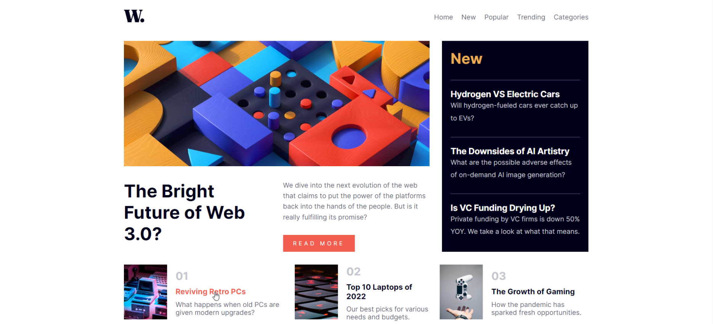
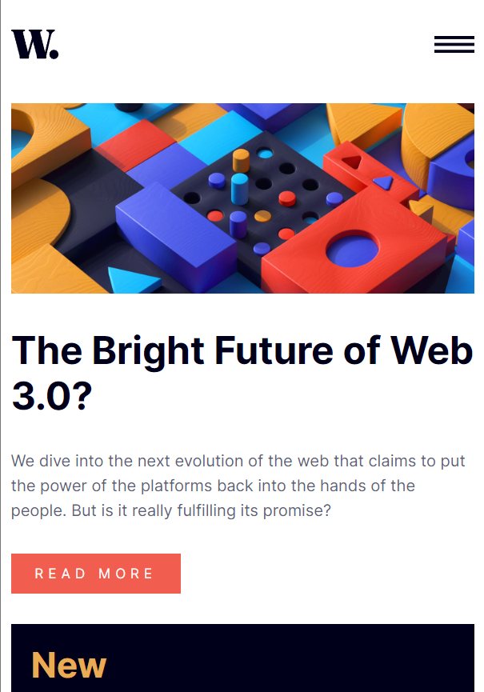
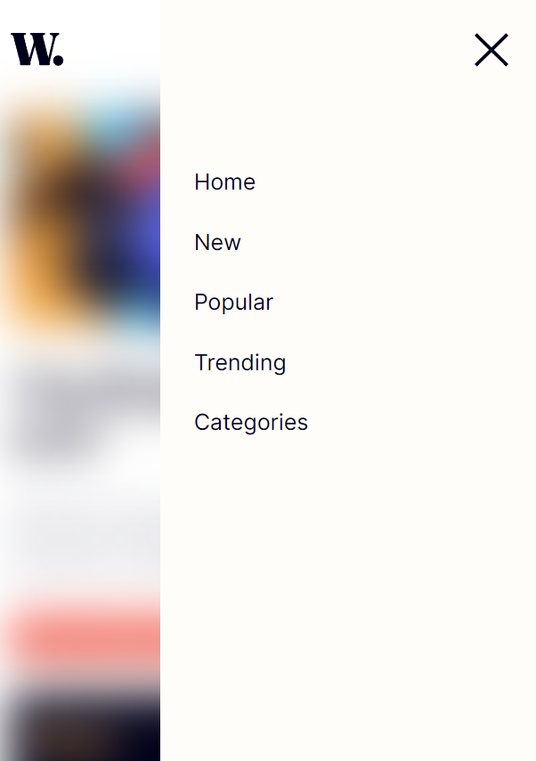

# Responsive News Homepage
- This challenge is taken from https://www.frontendmentor.io/chellanges.
- This design is layout created by using grid system with flex.
- Coded on html, css(scss), javascript
- The template has responsive design for mobile devices(created for 900px width)
- Add/Remove blur effect on click menu button( 8. and 15. lines) <a href="assets/js/app.js"> See JavaScript code </a>

  
# Pages
 
Desktop: 

      
Mobile Devices(for 960px width)

      
     

    

